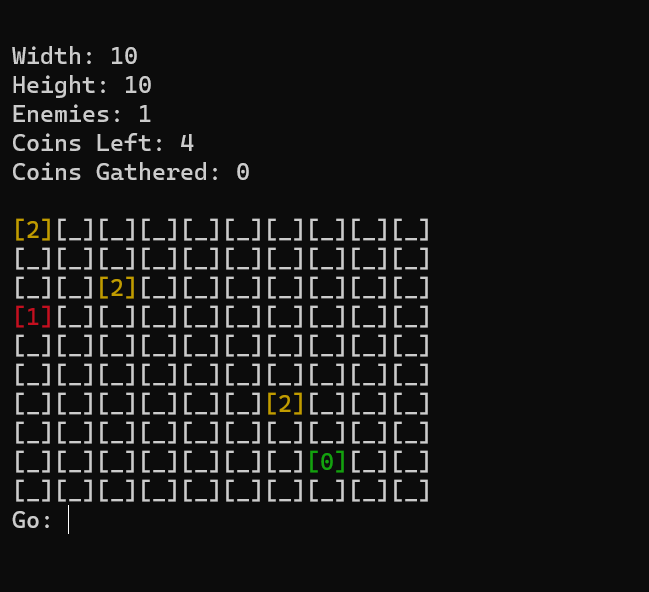

# game.py

A simple console-based game that has enemies and coins. Collect all the coins to win. Hit an enemy, and you're dead.

You can change the width and height of the grid, as well as the range of enemies and coins, and the starting coordinates.

- Green "[0]" is you. Control it by entering "l", "r", "u", "d".
- Red "[1]" is an enemy. Don't hit it.
- Yellow "[2]" is a coin. Collect it to win.

FYI, it sometimes glitches, just close and restart the script.
